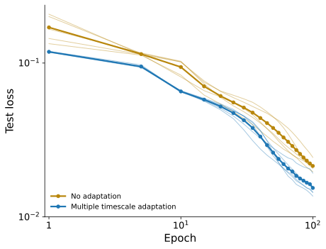

# train-srnn

Continuous-time recurrent networks with Dale's law, spike-frequency
adaptation, and short-term synaptic depression, trained by backpropagation
through time on long dynamical traces. The repository asks one question:
**does biologically motivated adaptation on multiple timescales help a
recurrent network learn a dynamical system?**

On next-step prediction of a simulated running cheetah (17 kinematic
channels at 100 Hz), the answer is yes. Networks with adaptation reach a
lower test loss than the same networks with adaptation removed, for every
one of five paired seeds.



| variant | test loss after 100 epochs (mean ± s.d., 5 seeds) |
|---|---|
| multi-timescale SFA + STD | 0.0154 ± 0.0022 |
| no adaptation | 0.0214 ± 0.0018 |

Details and the statistical test are in
[docs/results/adaptation_ablation.md](docs/results/adaptation_ablation.md).

## The model

`SRNNCell` integrates, for each of N rate neurons, a dendritic potential
x, up to three spike-frequency-adaptation variables a per neuron with
learnable time constants from 0.25 s to 4 s, and a synaptic-depression
variable b. The recurrent weight is a sparse random matrix with a
controlled spectral radius (Harris et al. 2023) that obeys Dale's law:
excitatory columns positive, inhibitory columns negative. Positive
parameters are stored in inverse-softplus space so any optimizer keeps
them positive, and the default solver is a linearly implicit Euler step
that is stable at the 10 ms time step of the data. The complete
specification, every parameter and its transform, is in
[docs/model.md](docs/model.md).

Every ablation is a variant of the same cell, and K variants run side by
side in one cell with a leading K axis, so an ablation study is one batched
forward pass rather than K training runs. Variants are named by tokens:

```
srnn                          full model
srnn-no-adapt                 no SFA, no STD
srnn-e-only-skip              adaptation on excitatory neurons only, residual skip
srnn-no-dales-skip-seed3      unsigned weights, skip, recurrent seed 3
```

The grammar is in [docs/variants.md](docs/variants.md). Variants that share
a seed share the same recurrent matrix, so comparisons across variants are
paired on connectivity.

## What is here

- `train_srnn/models/`: the SRNN cell, a common `RNNCell` interface, the
  Hasani et al. baselines (LTC, CTRNN, neural ODE, CT-GRU, LSTM), the
  random-matrix connectivity, and `SequenceModel` (neuron partition,
  trainable initial state, truncated BPTT with gradient checkpointing,
  closed-loop teacher forcing).
- `train_srnn/training/`: a `Trainer` base with two loops. The windowed
  trainer draws augmented windows with the state reset per batch. The
  continuous trainer places B readers around the training trace as a ring
  and never resets the state, so long-timescale adaptation variables carry
  across epochs.
- `train_srnn/data/`: `Task` classes. `cheetah100` is the primary task; the
  eight classification and regression benchmarks from Hasani et al. are
  kept as baselines; `synthetic` is a data-free smoke task.
- `train_srnn/config.py`: every task and model as a typed dataclass
  registered with Hydra, so a misspelled key fails at startup.
- `cloud/`: one-command dispatch of a run to a GCE L4 VM that stages the
  data, trains, uploads to GCS, and stops or deletes itself
  ([docs/cloud.md](docs/cloud.md)).
- `scripts/`: post-run analysis (learning curves, parameter evolution,
  forward replay with Lyapunov exponents, gradient probes), all reading a
  run from `$SRNN_CACHE_DIR`.
- `tests/`: a pytest suite including golden snapshots that pin the forward
  outputs and gradients of every cell.

## Setup

```bash
uv sync                                   # Python 3.12 venv in .venv
export SRNN_HOME=/path/to/data-and-results
```

Datasets live in `$SRNN_HOME/data/<task>/`, runs in
`$SRNN_HOME/results/<task>/<run_name>/`, downloads made by the analysis
scripts in `$SRNN_HOME/cache/`. Each can be overridden separately with
`SRNN_DATA_DIR`, `SRNN_RESULTS_DIR`, `SRNN_CACHE_DIR`.

The cheetah dataset is generated by the companion
[gen-half-cheetah-dataset](https://github.com/TomRichner/gen-half-cheetah-dataset)
repository; copy its `data/cheetah_100hz/{train,valid,test}.npz` and
`manifest.json` into `$SRNN_HOME/data/cheetah100/`. The benchmark tasks
expect the UCI files at the paths used by Hasani et al.'s
`download_datasets.sh`, under `$SRNN_HOME/data/<task>/`.

## Training

```bash
# adaptation vs none, five paired seeds, in one batched run
python train.py task=cheetah100 model=srnn \
    model.variants=[srnn-no-dales-skip,srnn-no-adapt-no-dales-skip] \
    model.variant_seeds=[1,2,3,4,5] epochs=100 checkpoint_interval=5 warmup_epochs=3

# a single variant, smaller network
python train.py task=cheetah100 model.variants=[srnn-skip] model.num_units=64

# a baseline cell on a benchmark task
python train.py task=har model=ltc epochs=50

# no data needed
python train.py task=synthetic epochs=2 device=cpu compile.enabled=false
```

Every field of the config is a command-line override; `python train.py
--help` lists the groups and `train_srnn/config.py` documents each field.
A run directory holds `init.pt`, periodic `epoch_*.pt`, `last.pt`,
`training_history.csv`, `test_history.csv`, `progress.json`, and the
resolved config under `.hydra/`.

Closed-loop training (`closed_loop.enabled=true`) blends each input with
the model's previous prediction, with the mixing fraction sampled per
batch and ramped over the run; see `ClosedLoopConfig`.

## Tests

```bash
uv run pytest -q            # ~1 min on CPU
uv run pytest -m slow       # the baseline cell x benchmark task matrix (needs the datasets)
```

`tests/golden/` holds forward outputs and gradients recorded from every
cell at small shapes and three optimizer steps of each trainer. Any change
to the numerics must either keep them bitwise or regenerate them
deliberately with `tests/golden/make_golden.py`.

## Cloud runs

```bash
bash cloud/launch_run_gpu.sh --cleanup=keep myrun cheetah100 srnn 1 \
    "model.variants=[srnn,srnn-no-adapt] epochs=100"
bash cloud/submit.sh <vm> myrun2 cheetah100 srnn 1 "epochs=200"    # re-dispatch to a kept VM
python scripts/postprocess.py myrun --task cheetah100             # download + plots + report
```

## Documentation

- [docs/model.md](docs/model.md): the equations, parameters, transforms, solvers.
- [docs/variants.md](docs/variants.md): the variant-name grammar.
- [docs/architecture.md](docs/architecture.md): how the code fits together, tensor shapes, state layout.
- [docs/cloud.md](docs/cloud.md): the GCE dispatch pipeline.
- [docs/known_issues.md](docs/known_issues.md): open limitations.
- [docs/math/std_asymptote.md](docs/math/std_asymptote.md): why synaptic depression bottoms out at about 0.2.

## Provenance and acknowledgements

This repository began as an independent PyTorch port of the TensorFlow 1.x
experiment code that accompanies Hasani et al.'s liquid time-constant
networks paper, and then grew the SRNN research on top of that harness. It
is not a fork of the authors' later `ncps` package: the port was needed for
its benchmark loaders and its cell interface, which the SRNN, the batched
variants, and the ring trainer all share.

| ported from Hasani et al. (Apache 2.0, see NOTICE) | new in this repository |
|---|---|
| LTC cell with three solvers | SRNN cell, K-batched variants, variant grammar |
| CTRNN, neural ODE, CT-GRU cells | random-matrix connectivity under Dale's law |
| the eight benchmark loaders and their splits | continuous ring trainer, closed-loop teacher forcing |
| | typed Hydra config, `Trainer`, `SequenceModel` |
| | cheetah100 task and dataset, GCE dispatch, analysis tooling |

References:

- Hasani, R., Lechner, M., Amini, A., Rus, D., & Grosu, R. (2021). Liquid
  time-constant networks. AAAI. https://arxiv.org/abs/2006.04439
- Harris, I. D., Meffin, H., Burkitt, A. N., & Peterson, A. D. H. (2023).
  Effect of sparsity on network stability in random neural networks obeying
  Dale's law. Physical Review Research, 5(4), 043132.
  https://doi.org/10.1103/PhysRevResearch.5.043132
- Mozer, M. C., Kazakov, D., & Lindsey, R. V. (2017). Discrete event,
  continuous time RNNs. https://arxiv.org/abs/1710.04110 (CT-GRU baseline)

## License

Apache License 2.0. See [LICENSE](LICENSE) and [NOTICE](NOTICE).
